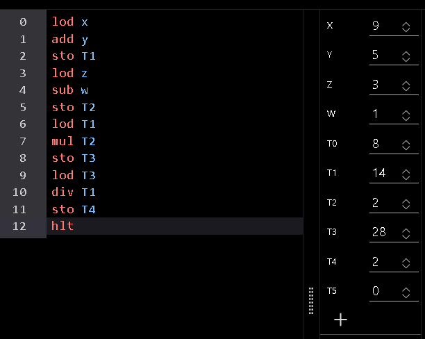

# ARQUITECTURA DE VON NEWMAN

## **1. ¿Qué bloque crees que se encarga de realizar las sumas y restas?**
### En el caso de las operaciones el encargado de realizarlas es la ALU (o unidad aritmético-lógica) pudiendo cumplir con la función de sumas y restas de números enteros y operaciones más específicas como multiplicaciones y divisiones o incrementos y decrementos .

## **2. ¿Qué bloque dirige y gobierna al resto de unidades funcionales?**
### El bloque encargado de dirigir o gobernar sobre el resto de unidades es la Unidad de Control (o UC) encargado de gestionar tareas como control de secuencias de ejecución o bien gestión de la memoria , entre otras tareas .

## 3. **¿A qué bloque crees que pertenece la memoria RAM?**
### Pertenece al bloque de la memoria principal de un sistema informático , siendo una memoria dedicada tanto para lectura como para escritura.

## **¿Qué ocurriría ante una falta de suministro eléctrico?**
### La memoria RAM al ser una memoria volátil y que solo permanece cuando tenemos el equipo encendido , a pagarlo o al cortar el suministro eléctrico a nuestro equipo , esta memoria desaparece sin dejar rastro .

## 4. **¿A qué bloque crees que pertenecería un disco duro?** 
### El disco duro al ser una unidad pensada en todo caso para el almacenamiento de datos , este se considera una unidad de memoria secundaria o masiva .

## **¿Qué ocurriría ante una falta de suministro eléctrico?** 
### Simplemente al ser una memoria de almacenamiento secundaria , los datos que se han recopilado dentro de la unidad se quedan guardados dentro de este .

## 5. **¿Qué diferencia hay entre los datos y las instrucciones?**
### Los datos en este caso es la información que es introducida por un usuario y procesada por el sistema y las instrucciones vienen de por sí introducidas dentro del sistema .  

## 6. **Enumera los elementos que componen la unidad de control, indicando para qué sirven.** 
### Contador de Programa :
Contiene la dirección de las instrucciones que se deben ejecutar . Después de cada instrucción, el contador de programa se incrementa para apuntar a la siguiente instrucción en secuencia, o se actualiza en caso de una instrucción de salto o bifurcación.
### Registro de Instrucción :
Almacena la instrucción que está siendo actualmente ejecutada por la CPU. Una vez que el Contador de Programa apunta a la siguiente instrucción, esta se carga en el IR para su decodificación y ejecución.
### Decodificador de Instrucciones:
Analiza la instrucción almacenada en el IR y genera las señales de control necesarias para que los diferentes componentes de la CPU realicen las acciones requeridas. Decodifica el código de operación y determina las acciones específicas que deben ejecutarse.
### Generador de Señales de Control:
Produce señales de control que coordinan las operaciones de la ALU, los registros, la memoria y otros dispositivos de la CPU. Estas señales determinan qué acción debe realizarse en cada momento, como leer de memoria, escribir en un registro o realizar una operación aritmética.
### Unidad de Temporización y Sincronización:
Gestiona el ritmo de las operaciones de la CPU utilizando el reloj del sistema. Asegura que todas las acciones se realicen en el momento adecuado, coordinando el tiempo entre las señales de control y la ejecución de las operaciones.
### Unidad de Control de Secuencia:
Determina el orden de ejecución de las instrucciones, manejando las operaciones secuenciales y de salto (bifurcación, bucles, saltos condicionales). Gestiona el flujo de control en los programas.
### Registro de Estado o Registro de Banderas :
Contiene banderas que indican el estado actual de la CPU y los resultados de operaciones lógicas o aritméticas, como la señal de cero, de acarreo, de desbordamiento, etc. Estas banderas ayudan a la Unidad de Control a tomar decisiones sobre las siguientes operaciones.
### Control de Interrupciones:
Permite a la CPU responder a eventos inesperados, como señales de entrada/salida, errores de hardware, o interrupciones de software. Pausa la ejecución normal para atender la interrupción y luego reanuda el proceso.

## 7. **Enumera los elementos que componen la ALU, indicando para qué sirven.**
### Circuitos de Operaciones Aritméticas:
Estos circuitos son responsables de realizar operaciones aritméticas básicas como suma, resta, multiplicación y división.
### Circuitos de Operaciones Lógicas:
Realizan operaciones lógicas bit a bit, esenciales para la manipulación de datos binarios.
### Circuitos de Desplazamiento y Rotación:
 Permite mover los bits de un operando hacia la izquierda o derecha.
### Registro de Acumulador:
Es un registro interno de la ALU que guarda temporalmente los resultados intermedios de las operaciones. Es esencial para realizar cálculos complejos en pasos sucesivos.
### Registro de Estado o Registro de Banderas :
Este registro guarda los indicadores de estado generados por las operaciones de la ALU.
### Multiplexores (MUX):
Controlan el flujo de datos dentro de la ALU, seleccionando qué datos se envían a través de los circuitos para su procesamiento.
### Unidad de Control Local de la ALU:
Controla las operaciones internas de la ALU, recibiendo instrucciones desde la Unidad de Control de la CPU y ejecutando las señales de control para activar los circuitos adecuados.

## 8. **Con respecto a la memoria principal, indica:** 
### Cómo se encuentra organizada. 
Se encuentra jerarquizada entre memoria de registro ( ubicada directamente en la CPU) , memoria caché ( memoria rápida en donde se encuentran datos frecuentemente usados) y la memoria RAM (donde se almacenan los datos y procesos que se mantienen activos)

### Qué es una dirección de memoria.
Se trata de un número o conjunto de números que indica el punto o localización exacta de un dato o una instrucción dentro de la memoria del equipo . Las direcciones actúan como puntos de referencia que el hardware y el software utilizan para acceder a la información almacenada.

### Cuál es el espacio de direccionamiento 
Es una representación lógica de todas las direcciones posibles que el hardware puede usar para localizar datos o instrucciones, tanto en la memoria principal (RAM) como en la memoria secundaria o masiva.

### Qué buses se conectan a la memoria, y que envían/recogen.
Son 3 buses concretamente , el bus de datos , bus de direcciones y el bus de control . 

## 9. **Explica el funcionamiento de la máquina de Von-Neumann. Puedes apoyarte en el PowerPoint visto en clase.**

### realiza la operación [(5+9)*(3-1)]/8

*teniendo en cuenta que he tomado los valores de*
**x=5**
**y=9**
**z=3**
**w=1**
**T0=8**
**T1=(x+y)**
**T2=(z-w)**
**T3=(T1*T2)**
**T4=T3/T0**
*entonces el modelo de von newman sería capaz de hacer dicha operación si se introducen los valores de la siguiente manera*

**Concluyendo con que el resultado es 2**

